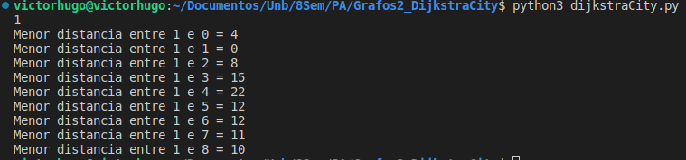
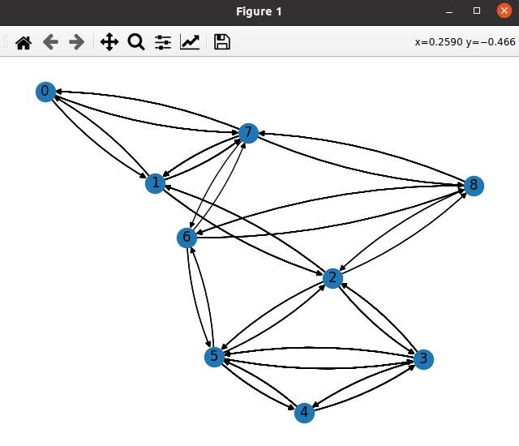

# Grafos2_DijkstraCity

**Número da Lista**: 35<br>
**Conteúdo da Disciplina**: Grafos 2<br>

## Alunos
|Matrícula | Aluno |
| -- | -- |
| 18/0023161  |  Luíz Gustavo Ferreira Rocha |
| 19/0038969  |  Victor Hugo Carvalho Silva |

## Sobre 
&emsp;A solução apresentada aqui tem como foco encontrar os menores caminhos para todos os vértices de um grafo, informando o vértice de saída. Com o fim de exercitar os conhecimentos da dupla em relação ao conteúdo de Grafos 2, é utilizado o algoritmo de Dijkstra.

## Screenshots


<br>



## Instalação 
**Linguagem**:Python 3.10.<br>
**Libs do Python**:networkx e  matplotlib (Caso não tenha instalado)<br>


## Uso
### DijkstraCity

&emsp; Nesse problema é informado um grafo de antemão, então através da entrada do usuário com a vértice "fonte", encontram-se os menores caminhos para todos os outros vértices e o glafo é apresentado.

#### Entrada

&emsp; Vértice de saída.

#### Saída

&emsp; Distâncias entre o vértice de saída e os outros vértices;<br>

##### Execute no terminal
```
python3 dijkstraCity.py 
```
##### Exemplo de Entrada
~~~
1
~~~

##### Exemplo de Saída
~~~
Menor distancia entre 1 e 0 = 4
Menor distancia entre 1 e 1 = 0
Menor distancia entre 1 e 2 = 8
Menor distancia entre 1 e 3 = 15
Menor distancia entre 1 e 4 = 22
Menor distancia entre 1 e 5 = 12
Menor distancia entre 1 e 6 = 12
Menor distancia entre 1 e 7 = 11
Menor distancia entre 1 e 8 = 10
~~~
<br><br>

## Outros

**OBS1:** O Vídeo apresentação se encontra na pasta outros deste repositório.


